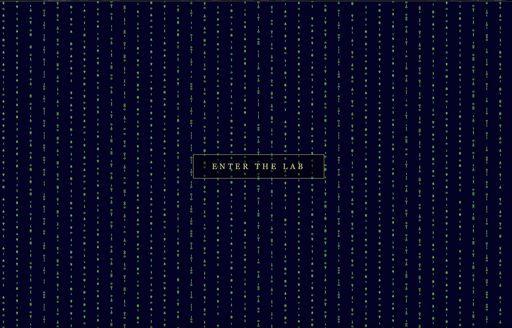
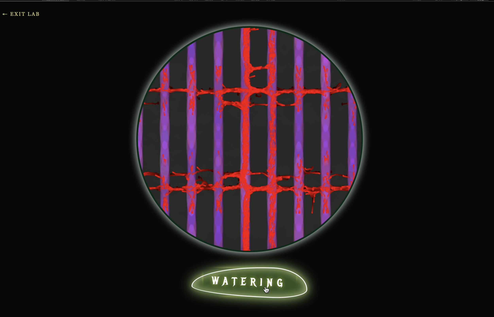
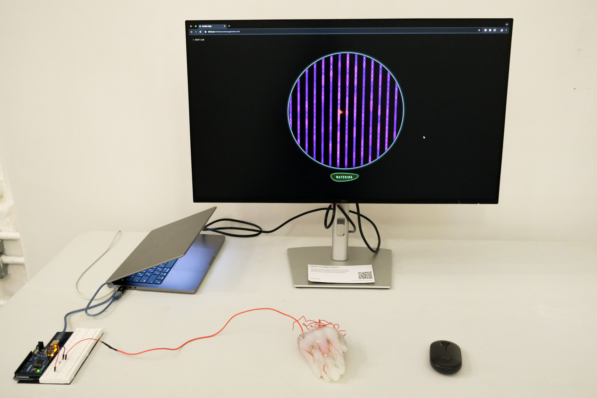

# Plant on Mars

## Short Description

This is an electronic biological website that simulates the biological algorithms of molds with physical sensing.

## Concept / Intent

My interest lies in the uncanny nature of "electronic life," whether manifested as cyborgs with mechanical flesh or kinetic sculptures like Theo Jansen’s Strandbeests. Through background research, I learned that seemingly chaotic organic processes, such as slime mold growth and branching, are actually governed by mathematical patterns that can be calculated by algorithms. Biological forms emerge from simple local rules through countless iterations. For instance, fractal geometry explains the branching of trees, while random walks and attraction fields constitute the pathfinding logic of slime mold.

My previous work, Kathrine(https://vimeo.com/1144591809?fl=ip&fe=ec), used physical pipes and acrylic paint to simulate blood flow. In this project, I repurposed the physical silicone components from Kathrine to serve as the tangible interface, evolving the inquiry into the possibility of a digital screen becoming a synthetic vascular network. This project acts as a synthetic entity confined within phone or computer screens, reflecting the intimate and mundane symbiotic relationship between humans and machines in the digital age. Departing from typical aesthetics, I drew inspiration from the cult classic Little Shop of Horrors, adopting a Bio-digitalism aesthetic to evoke unease and curiosity.

## How to Run / Install

**1.Hardware Setup :**

Connect a 1MΩ resistor between Pin 4 and Pin 2 on an Arduino Mega 2560.

Connect the sensing wire (attached to the silicone hand) to Pin 2.

**2.Upload Code :**

Upload the .ino file within the arduino/ folder to your board.

**3.Calibrate Threshold:**

Open the Serial Monitor in Arduino IDE to observe the idle values.

Record the value when touching the silicone component (e.g., if it jumps from 200 to 1000+).

Ensure the threshold variable in sketch.js is set slightly above the idle noise but below the touch value to ensure stable interaction.

**4.Run Web App :**

Open index.html using Google Chrome.
Click the "Connect" button on the page and select the corresponding Serial Port.

## Requirements

- Hardware: Arduino Mega 2560, 1MΩ Resistor, Sensing material (e.g., silicone hand).
- Browser: Google Chrome or Edge (Supports Web Serial API).

## Screenshots / Media

Figure1: website page1

Figure2: website page2

Figure3: the setting

## Credits / Acknowledgements

Creator: Jing Chen

Reference: Tutorial by Patt Vira (p5.js Coding Tutorial | Slime Molds (Physarum)). https://youtu.be/VyXxSNcgDtg?si=LSoKrSjQNJos-HrP

## Contact / Links

GitHub: https://github.com/planetmarsno34-maker/plantOnMarsForPinUp.git

Demo Video: https://vimeo.com/1153196600?share=copy&fl=sv&fe=ci
